## 👋 Hi there, I am Charles.

I love coding in a lot of languages: C++17, C++20, C++23 and my favorite..., you guessed it, C++26.

As a typical C++ lovers, I love to ponder/read about low-level concepts, such as memory management, concurrency, operating systems, and networking. (My favorite activity while commuting is watch CppCon videos)

In my free time, I like to "rice" my workflow setup to be as cool as possible 😎. My goal is to become a 10x engineer that never touch the mouse. Feel free to steal it from [here](https://github.com/CharlesTran267/.dotfiles) (I also stole from others)

P/s: I use Linux, i3wm, Tmux, Neovim, btw.

### My GitHub Stats

